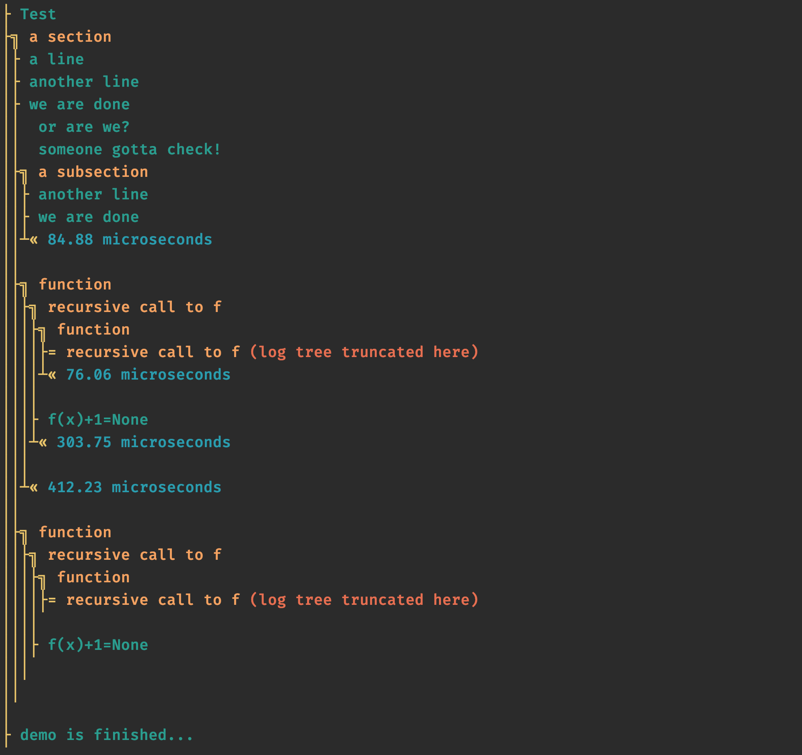

# arbol | Arborescent Printouts in Python

Do you have a script, a command line tool, or some workflow in Python that has lots of 'print' statements,
and you can't make sense of it once it adds up to hundreds of lines on the console? Sounds familiar?  
_arbol_ organises your stdout prints in a hierarchy that follows the structure of your code. Use a simple 
context manager to define the hierarchy and the 'aprint' command instead of print, and voila.
Moreover, _arbol_ measures the elpased time for each node of the tree and displays that conveniently.
Finally, when the optional dependencies are installed, the printed tree and text are colored with an 
exquisitely crafted combination of colors, making it even more visually appealing.  

If you are wondering, 'arbol' means 'tree' in spanish.  

Why not use a more traditional Python logging? We have made the choice of sticking to a plain and simple 
scheme that matches the usage of 'print' statements. Also we could have tried to intercept stdout and do 
some magic there, but we prefer to keep things simple and lean, and let you _choose_ to use _arbol_ where it makes sense.  

## Installation

Install with pip:

```sh
pip install arbol
```

## Optional dependencies

If you want colors, install the [ansicolors](https://pypi.org/project/ansicolors/) package:

```sh
pip install ansicolors
```

To make sure that you get the colors on all operating systems (particularly Windows), install the [colorama](https://pypi.org/project/colorama/)
package:

```sh
pip install colorama
```

Note: both colorama and ansicolors are optional -- _arbol_ will work fine without it installed.

## Example
Here is a simple and self-explanatory example:
```python

from arbol.arbol import aprint, asection, section, Arbol

# for colors, install the ansicolors package: 'pip install ansicolors',
# and for windows install the colorama package: 'pip install colorama'

# You can limit the tree depth:
Arbol.max_depth = 4

# use aprint (=arbol print) instead of the standard print
aprint('Test')

# You can decorate functions:
@section('function')
def fun(x):
    if x >= 0:
        with asection('recursive call to f'):
            aprint(f"f(x)+1={fun(x - 1)}")

# The context manager let's you go down one level in the tree
with asection('a section'):
    aprint('a line')
    aprint('another line')
    aprint('we are done \n or are we? \n someone gotta check!')

    with asection('a subsection'):
        aprint('another line')
        aprint('we are done')

    # works through function calls and the like...
    fun(2)

    # You can deactivate the elapsed time measurement and printing:
    Arbol.elapsed_time = False
    fun(100)

aprint('demo is finished...')

# You can also turn off all output with one switch:
Arbol.enable_output = False
aprint('you will not see that')


```

And this is how it looks like:



## Roadmap
Some ideas we might consider from serious to highly speculative:
- More color styles to choose from
- Intercept stdout from C code so that printouts from libraries called from python are formatted too, unclear is that's possible.
- Generate tree automatically by inspecting stack?
- Interoperability with logging package? 

## Contributions

Pull requests highly welcome! 

## Authors

Loic A. Royer (@loicaroyer)
Ahmet Can Solak (@_ahmetcansolak)

