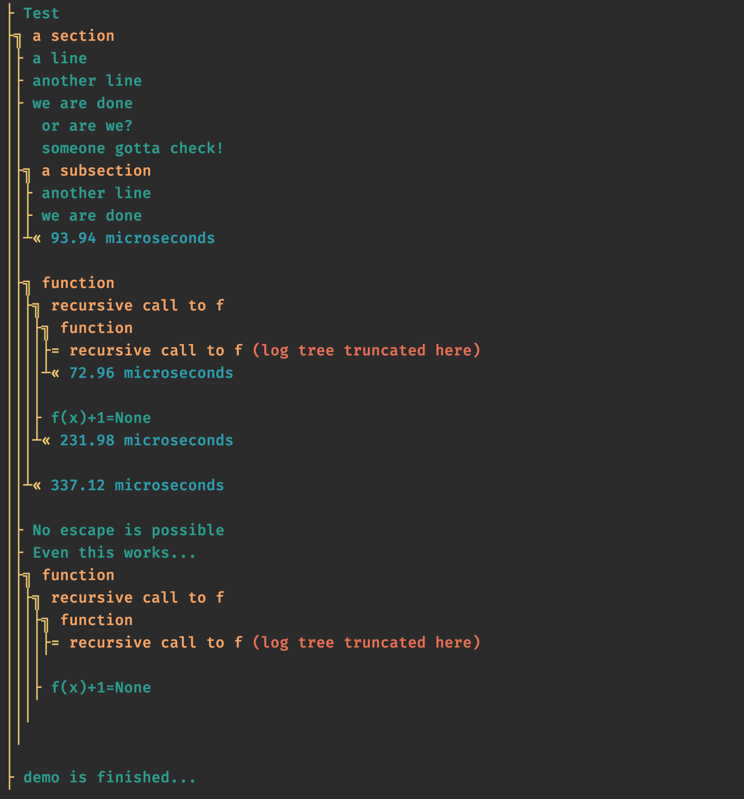

# arbol -- Arborescent Printouts in Python

Do you have a script, a command line tool, or some workflow in Python that has lots of 'prints out',
and you can't make sense of it? Sounds familiar?  
_arbol_ organises your stdout prints in a hierarchy that follows the structure of your code.
Moreover, _arbol_ measures the elpased time for each node of the tree and displays that conveniently.

Arbol means 'tree' in spanish.  

Why not use a more traditional Python logging? We have made the choice of sticking to a oplain and simple 
scheme that matches the usage of 'print' statements 

## Installation

Simply use pip:

```sh
pip install arbol
```

## Optional dependencies

If you want colors, install the [ansicolors](https://pypi.org/project/ansicolors/) package:

```sh
pip install ansicolors
```

T make sure that yo get the colors on all platforms including Windows, install the [colorama](https://pypi.org/project/colorama/)
package:

```sh
pip install colorama
```

Note: both colorama and ansicolors are optional -- _arbol_ will work fine without it installed.

## Example
Here is a simple example:
```python

from arbol.arbol import lprint, lsection, section, Arbol

# for colors, install the ansicolors package: 'pip install ansicolors',
# and for windows install the colorama package: 'pip install colorama'

# You can limit the tree depth:
Arbol.max_depth = 4

# use lprint instead of the standard print
lprint('Test')

# You can decorate functions:
@section('function')
def fun(x):
    if x >= 0:
        with lsection('recursive call to f'):
            lprint(f"f(x)+1={fun(x-1)}")

# The context manager let's you start a 'section' i.e. a node in the tree
with lsection('a section'):
    lprint('a line')
    lprint('another line')
    lprint('we are done')

    with lsection('a subsection'):
        lprint('another line')
        lprint('we are done')

    fun(2)

    # You can deactivate the elapsed time measurement and printing:
    Arbol.elapsed_time = False
    fun(100)

lprint('demo is finished...')

# You can also turn off all output with one switch:
Arbol.enable_output = False
lprint('you will not see that')

```




## Roadmap
Some ideas:
- More color styles to choose from
- Intercept stdout from C code so that printouts from libraries called from python are formatted too.
- Generate tree automatically by inspecting stack?
- Interoperability with logging package

## Authors

Loic A. Royer (@loicaroyer)
Ahmet Can Solak (@_ahmetcansolak)

